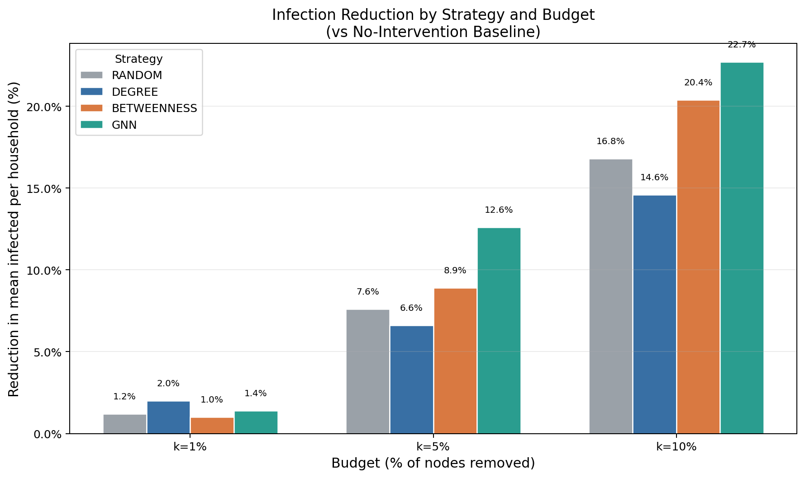
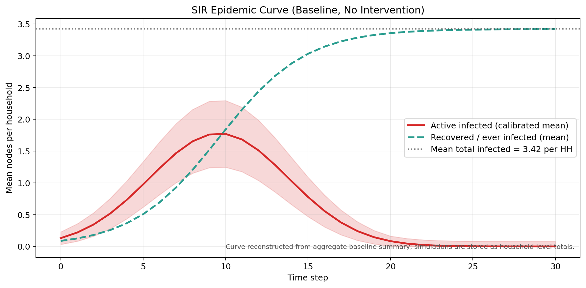

# CostTrace

**Budget-Constrained Epidemic Intervention on Household Contact Networks**

CostTrace is a reproducible social network analysis and epidemic intervention pipeline built on the SASHTS household contact dataset. The project turns raw proximity sensor events into a weighted contact graph, analyzes household-level network structure, learns node-level infection risk with a lightweight Weighted GraphSAGE proxy, and compares intervention strategies under limited public-health budgets.

The central question is practical: **if only 1%, 5%, or 10% of individuals can be prioritized for testing, monitoring, isolation, or follow-up, which nodes should be selected to reduce transmission most effectively?**

This README is written from the final report artifacts in [`[SNA] REPORT.pdf`](%5BSNA%5D%20REPORT.pdf), [`[SNA] REPORT_EN.docx`](%5BSNA%5D%20REPORT_EN.docx), [`reports/report.tex`](reports/report.tex), and the generated results under [`results/`](results/).

## Table of Contents

- [Project Summary](#project-summary)
- [Key Findings](#key-findings)
- [Visual Report](#visual-report)
- [Dataset](#dataset)
- [Methodology](#methodology)
- [Pipeline Stages](#pipeline-stages)
- [Modeling Details](#modeling-details)
- [Evaluation Design](#evaluation-design)
- [Results and Analysis](#results-and-analysis)
- [Repository Structure](#repository-structure)
- [Installation](#installation)
- [How to Run](#how-to-run)
- [Important Artifacts](#important-artifacts)
- [Limitations](#limitations)
- [Future Work](#future-work)
- [References](#references)

## Project Summary

In a household epidemic network, individuals do not contribute equally to disease spread. Some nodes have many direct contacts, some bridge dense subgroups, and some combine structural importance with epidemiological risk factors such as index-case exposure, susceptibility, age group, or sleeping/caregiving relationships.

CostTrace models this setting as a **budget-constrained node selection problem**:

1. Build a weighted undirected contact graph from proximity sensor data.
2. Measure topology, centrality, community structure, and node-level risk.
3. Train a Weighted GraphSAGE proxy to rank infection risk.
4. Select top-k nodes under fixed budgets.
5. Evaluate each strategy with both counterfactual transmission blocking and SIR simulation.

The project compares four strategies:

| Strategy | Selection Rule | Interpretation |
|---|---|---|
| Random | Uniform random node selection, averaged across repeats | Resource allocation without network intelligence |
| Degree | Highest degree centrality | Prioritize nodes with many direct contacts |
| Betweenness | Highest betweenness centrality | Prioritize structural bridge nodes |
| GNN | Highest GraphSAGE infection probability | Prioritize learned multi-feature risk |

## Key Findings

- The SASHTS graph contains **340 individuals**, **88 household components**, and **542 weighted contact edges** aggregated from **140,542 raw proximity events**.
- The graph is sparse globally, but very dense within households: global density is **0.0094**, while average household density is **0.9633**.
- Louvain community detection recovers **88 communities**, matching the household components with **100% household agreement** and **0.9696 modularity**.
- The Weighted GraphSAGE proxy achieves **test AUC = 0.7669** and **test Average Precision = 0.8995**, which is useful for top-k ranking even though the dataset is small.
- At **1% budget** only 3 nodes can be selected. Degree is the best counterfactual strategy, with **4.6% prevention rate**.
- At **5% and 10% budgets**, GNN becomes clearly stronger, reaching **26.8%** and **49.0% prevention rate**, with SIR reductions of **22.2%** and **42.7%**.
- There is no universally dominant strategy. The best choice depends on budget size, evaluation metric, and whether explainability or learned risk ranking is more important.

## Visual Report

### Main Report Figures

<table>
  <tr>
    <td width="50%">
      
      <br><strong>Network overview.</strong> Node size follows degree centrality, colors indicate household/community structure, and highlighted nodes indicate high composite risk.
    </td>
    <td width="50%">
      
      <br><strong>Degree distribution.</strong> Household contact networks are locally dense but bounded by small household sizes.
    </td>
  </tr>
  <tr>
    <td width="50%">
      
      <br><strong>Prevention-rate heatmap.</strong> GNN improves sharply at 5% and 10% budgets, while Degree remains competitive at 1%.
    </td>
    <td width="50%">
      
      <br><strong>SIR reduction by strategy.</strong> GNN produces the largest epidemic-size reduction as the intervention budget increases.
    </td>
  </tr>
  <tr>
    <td width="50%">
      
      <br><strong>SIR baseline.</strong> Baseline epidemic simulation before node removal.
    </td>
    <td width="50%">
      
      <br><strong>Budget recommendation.</strong> Degree is suitable for ultra-low and explainable selection; GNN is preferred once budget reaches 5% or more.
    </td>
  </tr>
</table>

### Topology and Intervention Figures

<table>
  <tr>
    <td width="50%">
      
      <br><strong>Topology network view.</strong>
    </td>
    <td width="50%">
      
      <br><strong>Connected components.</strong>
    </td>
  </tr>
  <tr>
    <td width="50%">
      
      <br><strong>Louvain communities.</strong>
    </td>
    <td width="50%">
      
      <br><strong>Centrality analysis.</strong>
    </td>
  </tr>
  <tr>
    <td width="50%">
      
      <br><strong>GraphSAGE model metrics.</strong>
    </td>
    <td width="50%">
      
      <br><strong>Intervention comparison.</strong>
    </td>
  </tr>
  <tr>
    <td width="50%">
      
      <br><strong>Strategy overlap.</strong>
    </td>
    <td width="50%">
      
      <br><strong>Final recommendation.</strong>
    </td>
  </tr>
</table>

## Dataset

CostTrace uses the **SASHTS - South Africa Household Transmission Study** dataset.

| Property | Value |
|---|---:|
| Raw proximity events | 140,542 |
| Individuals / nodes | 340 |
| Aggregated weighted contact edges | 542 |
| Households / connected components | 88 |
| Average household size | 3.86 |
| Average household density | 0.9633 |
| Overall graph density | 0.0094 |
| Average degree | 3.19 |
| Maximum degree | 7 |
| SARS positive individuals | 241 |
| SARS negative individuals | 99 |
| Observed attack rate | 70.9% |
| Index cases | 88 |
| Transmission edges | 286 |
| Non-transmission edges | 256 |

Available node attributes include site, age group, sex, SARS status, index/contact role, susceptibility, BMI category, smoking status, sleep-room exposure, caregiving exposure, virus variant, and household attack rate.

Site distribution:

| Site | Individuals |
|---|---:|
| Soweto | 197 |
| Klerksdorp | 143 |

Variant distribution:

| Variant | Count |
|---|---:|
| Beta | 171 |
| Delta | 38 |
| Variant Unknown | 16 |
| non-Alpha/Beta/Delta | 14 |
| Alpha | 13 |

## Methodology

The project follows a full research pipeline from raw event logs to intervention recommendation.


### Step 1 - Data Audit and Cleaning

Raw proximity events are loaded from [`data/raw/sashts_contact_network.csv`](data/raw/sashts_contact_network.csv), and participant metadata is loaded from [`data/raw/sashts_metadata.csv`](data/raw/sashts_metadata.csv).

The cleaning process:

- checks missing values,
- removes self-loops,
- canonicalizes pair order so A-B and B-A are treated as the same pair,
- tracks partial timestamp availability,
- aggregates repeated proximity events into one weighted edge per individual pair,
- validates that all edge endpoints exist in metadata.

Main output:

- [`data/processed/edges_clean.csv`](data/processed/edges_clean.csv)
- [`data/processed/metadata_clean.csv`](data/processed/metadata_clean.csv)

### Step 2 - Weighted Contact Graph Construction

Each individual becomes a node. Each contact pair becomes an undirected edge weighted by total contact duration in seconds.

The graph stores:

- edge weight: `total_duration_sec`,
- contact frequency: `n_contacts`,
- transmission label: `pair_sars`,
- partial timestamp flag: `has_real_ts`,
- node-level metadata from the SASHTS participant table.

Main output:

- [`data/processed/graph.pkl`](data/processed/graph.pkl)
- [`data/processed/nodelist.csv`](data/processed/nodelist.csv)
- [`data/processed/edgelist.csv`](data/processed/edgelist.csv)
- [`results/gephi/contact_network.gexf`](results/gephi/contact_network.gexf)

### Step 3 - Network Topology

The graph is analyzed as 88 household components. This matters because the global graph is disconnected by design: there are no cross-household edges in this dataset.

Measured topology includes:

- number of nodes and edges,
- connected components,
- household density,
- household diameter,
- clustering coefficient,
- degree distribution,
- weighted degree distribution.

The main structural insight is that the network is sparse globally but dense within households. Therefore, household-level interpretation is more meaningful than global connectedness.

### Step 4 - Centrality and Community Detection

CostTrace computes:

- Degree Centrality,
- Weighted Degree,
- Betweenness Centrality,
- Closeness Centrality,
- Louvain community assignments.

Louvain identifies 88 communities with 100% agreement against household labels. This confirms that household boundaries dominate the community structure.

### Step 5 - Composite Risk Score

A simple interpretable risk score is built from normalized structural and exposure features:

```text
composite_risk_score =
  0.35 * degree_centrality_norm
+ 0.30 * weighted_degree_sec_norm
+ 0.20 * betweenness_centrality_norm
+ 0.15 * sleep_room_enc
```

This score is not the final model. It acts as an interpretable baseline and as a feature engineering bridge for later GNN-based risk ranking.

### Step 6 - Weighted GraphSAGE Proxy

The GNN model is a lightweight pure-PyTorch Weighted GraphSAGE classifier. It learns node infection probability from both network structure and epidemiological metadata.

The model is used for **ranking**, not as a clinical diagnosis system. In budget-constrained intervention, ranking the top-k highest-risk nodes is more important than producing a perfect binary classifier.

### Step 7 - Budget-Constrained Top-k Selection

For each budget level, the project selects the top-k nodes according to each strategy:

| Budget | Nodes Selected |
|---:|---:|
| 1% | 3 |
| 5% | 17 |
| 10% | 34 |

The selected nodes are saved in [`results/intervention/selected_nodes_by_strategy.json`](results/intervention/selected_nodes_by_strategy.json).

### Step 8 - Counterfactual Transmission Evaluation

Counterfactual analysis asks: if selected nodes were removed or successfully intervened on, how many observed transmission edges and secondary/contact infections would be blocked?

Core metrics:

- `transmissions_blocked`,
- `transmission_block_rate_pct`,
- `infections_prevented`,
- `prevention_rate_pct`,
- selected index cases,
- selected contacts,
- SARS-positive contacts selected.

### Step 9 - SIR Simulation

The project also runs an SIR simulation per household component.

Parameters:

| Parameter | Value |
|---|---:|
| Infection rate `beta` | 0.25 |
| Recovery rate `gamma` | 0.10 |
| Time horizon | 30 days |
| Monte Carlo runs | 50 |
| Random seed | 42 |
| Baseline mean infected per household | 3.4214 |

Transmission probability is scaled by log contact duration:

```text
log1p(total_duration_sec) / log1p(max_duration_sec)
```

## Pipeline Stages

The executable entrypoint is [`main.py`](main.py). It organizes the project into five reproducible phases.

| Phase | Main Scripts | Purpose |
|---|---|---|
| `prepare` | `audit.py`, `curation.py`, `graph.py`, `profile.py` | Validate raw data, clean events, build graph, export EDA summary |
| `metrics` | `topology.py`, `centrality.py`, `community.py`, `risk.py` | Compute topology, centrality, Louvain communities, composite risk |
| `model` | `graphsage.py` | Train Weighted GraphSAGE and export risk scores |
| `budget` | `allocation.py`, `counterfactual.py`, `simulation.py`, `evaluation.py` | Select nodes, evaluate transmission blocking, run SIR, summarize results |
| `notebooks` | `notebooks.py` | Generate notebook-oriented figures and report visuals |

## Modeling Details

### Input Features

The GraphSAGE proxy uses 11 features:

| Feature | Type | Meaning |
|---|---|---|
| `degree_centrality_norm` | Continuous | Normalized degree centrality |
| `weighted_degree_sec_norm` | Continuous | Normalized total contact duration |
| `betweenness_centrality_norm` | Continuous | Normalized bridge-like structural role |
| `closeness_centrality_norm` | Continuous | Normalized average distance to household members |
| `sleep_room_enc` | Binary | Slept in same room as index case |
| `cared_by_enc` | Binary | Was cared for by index case |
| `age_enc_scaled` | Ordinal scaled | Encoded age group |
| `sex_enc` | Binary | Male/Female encoding |
| `sus_enc` | Binary | Susceptibility encoding |
| `site_enc` | Binary | Soweto/Klerksdorp encoding |
| `is_index` | Binary | Index-case role |

### Training Configuration

| Setting | Value |
|---|---|
| Model | `WeightedGraphSAGEClassifier` |
| Implementation | Pure PyTorch weighted mean aggregation |
| Hidden dimension | 32 |
| Epochs | 500 |
| Best epoch | 150 |
| Optimizer | Adam |
| Learning rate | 0.01 |
| Weight decay | 5e-4 |
| Split | Stratified 70% train, 15% validation, 15% test |
| Threshold | 0.24 |
| Seed | 42 |
| Edge weighting | `log1p(total_duration_sec)`, row-normalized |

### Model Performance

| Split | AUC | Average Precision | F1 | Precision | Recall |
|---|---:|---:|---:|---:|---:|
| Train | 0.9914 | 0.9966 | 0.9619 | 0.9480 | 0.9762 |
| Validation | 0.8036 | 0.9162 | 0.8732 | 0.8857 | 0.8611 |
| Test | 0.7669 | 0.8995 | 0.8158 | 0.7949 | 0.8378 |

The train-test gap indicates overfitting risk, which is expected with only 340 nodes. However, the high test Average Precision suggests that the model is still useful for ranking high-risk nodes.

## Evaluation Design

CostTrace evaluates interventions with three complementary views:

| Metric Family | Question Answered |
|---|---|
| Top-k selection | Are selected nodes actually high-risk or transmission-relevant? |
| Counterfactual transmission | How many observed transmission edges and secondary cases would be blocked? |
| SIR simulation | How much does simulated epidemic size decrease after node removal? |

Important metrics:

- `precision_k_pct`: percentage of selected nodes that are SARS positive.
- `transmission_coverage`: percentage of observed transmission edges incident to selected nodes.
- `prevention_rate_pct`: percentage of SARS-positive contact cases prevented in counterfactual analysis.
- `reduction_vs_baseline_pct`: SIR reduction against baseline mean infected per household.

## Results and Analysis

### Final Strategy Comparison

| Budget | Nodes | Strategy | Precision@k | Transmission Coverage | Prevention Rate | SIR Reduction |
|---:|---:|---|---:|---:|---:|---:|
| 1% | 3 | Degree | 100.0% | 2.4% | **4.6%** | 2.0% |
| 1% | 3 | GNN | 100.0% | 2.1% | 3.9% | **3.8%** |
| 1% | 3 | Random | 71.7% | 1.7% | 3.3% | 1.2% |
| 1% | 3 | Betweenness | 66.7% | 0.3% | 0.7% | 1.0% |
| 5% | 17 | GNN | 100.0% | 14.3% | **26.8%** | **22.2%** |
| 5% | 17 | Random | 70.8% | 9.7% | 17.4% | 7.6% |
| 5% | 17 | Betweenness | 64.7% | 6.3% | 11.8% | 8.9% |
| 5% | 17 | Degree | 64.7% | 8.4% | 10.5% | 6.6% |
| 10% | 34 | GNN | 100.0% | 26.2% | **49.0%** | **42.7%** |
| 10% | 34 | Random | 70.7% | 19.2% | 33.0% | 16.8% |
| 10% | 34 | Betweenness | 70.6% | 16.4% | 30.7% | 20.4% |
| 10% | 34 | Degree | 64.7% | 17.1% | 22.2% | 14.6% |

### Interpretation by Budget

**1% budget.** Only three nodes are selected, so results are sensitive to individual node choice. Degree performs best in counterfactual prevention because the highest-degree nodes directly cover more transmission edges in small household components. GNN still produces the best SIR reduction, but the margin is small.

**5% budget.** GNN becomes the strongest strategy. It selects 17 nodes with 100% Precision@k and reaches 26.8% prevention rate. This shows that once more than a handful of nodes can be selected, multi-feature learned ranking becomes more useful than single centrality metrics.

**10% budget.** GNN dominates both evaluation layers. It blocks 75 observed transmission edges, reaches 49.0% prevention rate, and reduces simulated infections by 42.7% against baseline.

**Why Betweenness is weaker here.** Betweenness is usually important for bridge nodes, but SASHTS is composed of disconnected household components with no cross-household links. In this setting, bridge-like structure is less decisive than direct exposure, contact duration, and household infection risk.

**Why Degree remains important.** Degree is transparent and strong at ultra-low budget. If an intervention team needs a fast and explainable rule when only a tiny number of people can be selected, Degree is a reasonable first baseline.

**Why GNN improves at larger budgets.** GNN combines centrality, weighted contact duration, household exposure indicators, susceptibility, demographics, site, and index-case role. This helps it recover risk patterns that no single centrality metric can express.

## Repository Structure

```text
CostTrace/
  data/
    raw/                     Raw SASHTS files and source notes
    processed/               Cleaned edges, nodes, graph object, EDA summary
  logs/                      Pipeline logs
  models/                    Trained GNN weights and metadata
  notebooks/                 Generated topology and intervention notebooks
  reports/
    report.tex               Final report source
    slides.pptx              Presentation deck
  results/
    gephi/                   Gephi-compatible graph export
    metrics/                 Topology, centrality, community, risk outputs
    model/                   GNN metrics and node risk scores
    intervention/            Top-k, counterfactual, SIR, final comparison
    figures/                 Notebook/report figures
  scripts/                   Extra chart and console-report scripts
  src/costtrace/
    preparation/             Data audit, cleaning, graph building, profiling
    analysis/                Topology, centrality, community, risk scoring
    modeling/                Weighted GraphSAGE proxy
    intervention/            Allocation, counterfactual, SIR, evaluation
    reporting/               Notebook and figure generation
  visualizations/            Main report charts and Gephi CSV exports
  main.py                    Pipeline entrypoint
  requirements.txt           Python dependencies
```

## Installation

Use Python 3.10 or newer.

```powershell
python -m venv .venv
.\.venv\Scripts\Activate.ps1
pip install -r requirements.txt
```

Dependencies:

```text
numpy
pandas
matplotlib
networkx
scikit-learn
torch
openpyxl
ipykernel
```

## How to Run

Run the full pipeline:

```powershell
python main.py --phase all
```

Run individual stages:

```powershell
python main.py --phase prepare
python main.py --phase metrics
python main.py --phase model
python main.py --phase budget
python main.py --phase notebooks
```

Recommended order for a clean reproduction:

1. `prepare` to rebuild cleaned data and graph artifacts.
2. `metrics` to recompute topology, centrality, communities, and risk features.
3. `model` to retrain Weighted GraphSAGE and export node risk scores.
4. `budget` to rerun top-k allocation, counterfactual analysis, SIR simulation, and final comparison.
5. `notebooks` to regenerate visual reporting artifacts.

The pipeline uses fixed seeds where randomness is involved. Small numeric differences can still appear if library versions differ.

## Important Artifacts

| Artifact | Purpose |
|---|---|
| [`data/processed/graph.pkl`](data/processed/graph.pkl) | NetworkX graph after preprocessing |
| [`data/processed/edgelist.csv`](data/processed/edgelist.csv) | Weighted edge list for analysis |
| [`data/processed/nodelist.csv`](data/processed/nodelist.csv) | Node attributes and graph features |
| [`data/processed/eda_summary.json`](data/processed/eda_summary.json) | Dataset summary statistics |
| [`results/metrics/basic_metrics.json`](results/metrics/basic_metrics.json) | Core topology metrics |
| [`results/metrics/centrality_scores.csv`](results/metrics/centrality_scores.csv) | Centrality table |
| [`results/metrics/community_metrics.json`](results/metrics/community_metrics.json) | Louvain community metrics |
| [`results/metrics/node_scores.csv`](results/metrics/node_scores.csv) | Composite risk and encoded features |
| [`results/model/gnn_metrics.json`](results/model/gnn_metrics.json) | GraphSAGE performance metrics |
| [`results/model/gnn_risk_scores.csv`](results/model/gnn_risk_scores.csv) | GNN infection probabilities |
| [`results/intervention/topk_budget_results.csv`](results/intervention/topk_budget_results.csv) | Top-k selection metrics |
| [`results/intervention/counterfactual_results.csv`](results/intervention/counterfactual_results.csv) | Counterfactual prevention metrics |
| [`results/intervention/sir_intervention_results.csv`](results/intervention/sir_intervention_results.csv) | SIR intervention results |
| [`results/intervention/final_comparison.csv`](results/intervention/final_comparison.csv) | Final strategy comparison table |
| [`results/intervention/final_strategy_summary.json`](results/intervention/final_strategy_summary.json) | Best strategy by budget |
| [`results/gephi/contact_network.gexf`](results/gephi/contact_network.gexf) | Graph export for Gephi |
| [`notebooks/topology.ipynb`](notebooks/topology.ipynb) | Topology and centrality notebook |
| [`notebooks/intervention.ipynb`](notebooks/intervention.ipynb) | Intervention and recommendation notebook |

## Limitations

- The dataset has only 340 nodes and is organized as household components, so conclusions should not be generalized directly to large urban, school, workplace, or online social networks.
- Klerksdorp records do not contain real timestamps, so the current graph is effectively static rather than temporal.
- The model is a lightweight GraphSAGE proxy, not a full reproduction of DeepTrace.
- The train-test performance gap suggests overfitting risk due to small sample size.
- Counterfactual removal assumes selected nodes can be fully intervened on, which is a simplifying public-health assumption.
- The SIR model uses calibrated assumptions and log-duration scaling, not a clinically validated transmission model.
- The current intervention logic does not explicitly filter out already recovered or non-infectious individuals.

## Future Work

- Extend the graph from static household components to temporal contact windows.
- Add recovery-aware candidate filtering to avoid spending budget on nodes that no longer transmit.
- Integrate spatial and temporal metadata for richer risk modeling.
- Validate the strategy trade-off on larger contact-network datasets such as schools, hospitals, workplaces, and public spaces.
- Compare the pure-PyTorch proxy against PyTorch Geometric implementations and more expressive GNN architectures.
- Develop an online decision-support version that updates node rankings as new contact events arrive.

## References

- Hamilton, W. L., Ying, R., and Leskovec, J. (2017). Inductive representation learning on large graphs. *NeurIPS*.
- Blondel, V. D., Guillaume, J. L., Lambiotte, R., and Lefebvre, E. (2008). Fast unfolding of communities in large networks. *Journal of Statistical Mechanics: Theory and Experiment*.
- Kermack, W. O., and McKendrick, A. G. (1927). A contribution to the mathematical theory of epidemics. *Proceedings of the Royal Society of London. Series A*.
- Keeling, M. J., and Eames, K. T. D. (2005). Networks and epidemic models. *Journal of the Royal Society Interface*.
- Kiss, I. Z., Miller, J. C., and Simon, P. L. (2017). *Mathematics of Epidemics on Networks*. Springer.
- Tan, C. W., Yu, P. D., Chen, S., and Poor, H. V. (2025). DeepTrace: Learning to optimize contact tracing in epidemic networks with graph neural networks.
- Kleynhans, J. et al. SASHTS - South Africa Household Transmission Study physical proximity contact sensor data and epidemiological outcomes.

## Project Status

This repository is intended for academic research and coursework. It demonstrates how social network analysis, graph learning, and epidemic simulation can support budget-aware intervention planning. It is not a medical decision system and should not be used as direct public-health guidance without expert validation.
